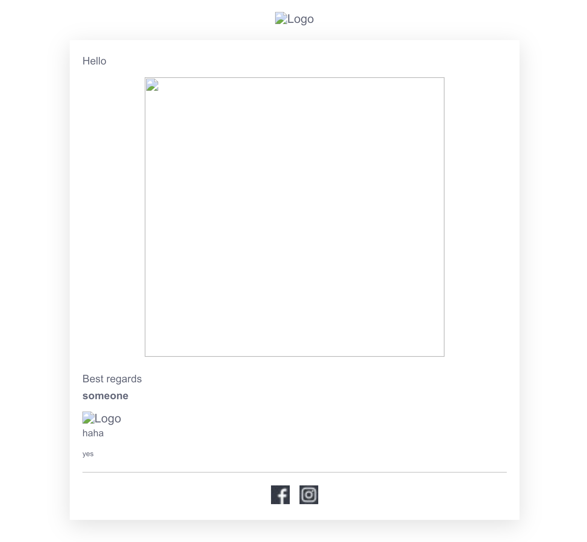

# HTML Mail Sender
Easy script to send html emails and more hints to get you started asap.

## first
go to credentials.rb and insert your smtp credentials

## mail-template-example.html
If you don't have your own template, you can (AND SHOULD) start with this one.

It looks good on **every** mobile device. Just insert your images and go! It's based on [one of these from Foundation](https://get.foundation/emails/email-templates.html) iirc.

When you modify it, remember this:

You might want to remove this line entirely or change it in `mail-template-example.html`

	<title>Betreff</title>

Also to have your custom email template, scroll to the bottom in the file and adjust everything you need including facebook and instagram links.

## example call
	./send_mail.rb target@example.com "my subject" mail-template-example.html

## Attachments, CC, BCC
For these configurations, see the bottom of the send_mail.rb

## Test Deliverability for free
Do that here, best tool ever: https://mail-tester.com

Spelling is very important here because there are competitors with very similar names.
